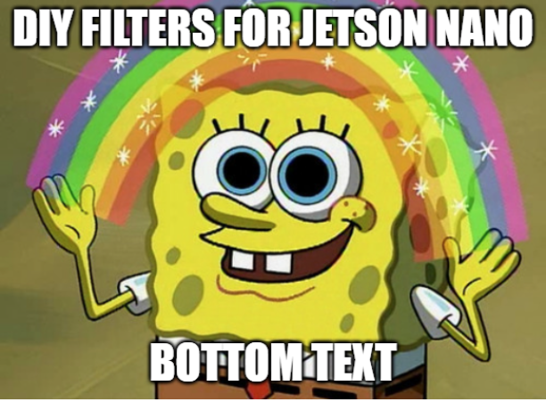

# DIYVideoFiltersForJetsonNano
EE551 - Instgram-style video filters for the NVidia Jetson nano

2 scripts at present

filtersForJetson.py is for actually running code on the jetson per the assignment

filtersForLaptop.py is identical, except for video pipeline, which instead uses laptop webcam
- This is more useful for developing on IMO, means we're not suffering with Jetson the whole time
- Will also want to adapt Jetson code to be Cuda enabled where possible, will improve our performance massively
## Before filter:

## After Filter

