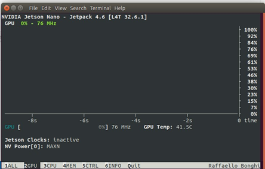

# EE551 – DIY Filters on Jetson Nano Project 
- [Sean Breen](https://github.com/seanbreen01)
- [Aidan Dempsey](https://github.com/aidandempsey)

## Contents
1. [Introduction/Problem Statement](#introductionproblem-statement)
2. [Algorithms/System Design](#algorithmssystem-design)
    1. [Camera Input](#camera-input)
    2. [Facial Detection](#facial-detection)
    3. [Object Detection](#object-detection)
    4. [CUDA and GPU Acceleration](#cuda-and-gpu-acceleration)
    5. [GUI](#gui)
    6. [Filters](#filters)
3. [Testing and Results](#testing-and-results)
    1. [Upper Body Detection](#upper-body-detection)
    2. [GUI](#gui-1)
    3. [CUDA and GPU Acceleration](#cuda-and-gpu-acceleration-1)
    4. [CPU Under-Utilisation](#cpu-under-utilisation)
4. [Discussion (Analysis of Implementation Performance)](#discussion-analysis-of-implementation-performance)
5. [Suggested Improvements](#suggested-improvements)
6. [References](#references)

## Introduction/Problem Statement

The aim of this assignment is to develop a set of real-time video processing filters to be implemented via Python and run on an Nvidia Jetson Nano video feed. In this report we will detail our use of more traditional image processing techniques. Techniques including bitwise pixel manipulation, facial feature detection using Haarcascades, and the creation and combination of masks, among others. We will also discuss our integration of neural network methodologies into the filter of the group’s choice, to demonstrate technical ability in this increasingly important area of image processing.  

The overall processing pipeline for each frame in the input video stream will be explained in detail, highlighting areas where optimizations were made to benefit performance on embedded devices such as the Jetson Nano. We will explore in particular detail the use of the Nano’s onboard GPU to enhance the efficiency of image processing, and the considerations made to best utilise this functionality via OpenCV’s inbuilt CUDA library.   

We will subsequently discuss and analyse the performance of the filters as designed, highlighting areas where these perform satisfactorily. Additionally, limitations of the filters designed and explanations for said limitations will be explored. This report will then conclude with some recommendations for future improvements to aid the performance and usability of the system.  

## Algorithms/System Design

For each filter, the video feed was broken down frame by frame using OpenCV’s built in `cv2.VideoCapture()` method. Using this function, individual video frames are passed to selected filter functions, and processed according to the needs of said filter. Finally, the processed frame is returned and displayed in a window to the user, showing the now filtered output video stream in real time.  

### Camera Input 

For this project a CSI camera input feed (taken from a Raspberry Pi Camera Module 2) was passed to a GStreamer pipeline to create our video feed for processing.  Certain parameters of the GStreamer pipeline were adjusted to improve the overall efficiency of the system and allow for enhanced filtering speed. These adjustments included decreasing the resolutions of both the video capture from the camera, and the displayed video output to 1280x720 and 640x480 respectively. This was determined to be a reasonable trade-off for the project to make, as the resolution of the input is still sufficiently high to have good quality, useful data for processing and face detection, without having unnecessary information that slows processing and unnecessarily consumes otherwise valuable system resources.  

Corresponding to these decreases in resolution, the framerate was increased to 60fps, from the default 30fps, with the goal of further enhancing the smoothness of the system. By having more up to date information on what is actually ‘in front of the camera’, the system is better positioned to filter appropriately and appear closer to real-time than might otherwise be the case on an embedded device. 

The input video stream is passed frame by frame into each of the respective functions, based on what selection the user has made. This selection is made by the user, either via the GUI in the case of the [allFilters_GUI.py](./allFilters_GUI.py) script, or by the running of the individual scripts for each filter type, i.e. [noGUIBackgroundBlur.py](./noGUIBackgroundBlur.py), [noGUIBackgroundReplace.py](./noGUIBackgroundReplace.py), etc.  

### Facial Detection 

To perform facial recognition, we utilized Haarcascades, more specifically [haarcascade_frontalface_default.xml](./haarcascades_cuda/haarcascade_frontalface_default.xml). This XML file represents a pre-trained Haar Cascade Classifier model designed for detecting faces. This specific implementation of the Haar Cascade Classifier is additionally optimized for CUDA which we will discuss in detail in subsequent sections of this report. For more detailed facial feature recognition, we made use of [haarcascade_eye.xml](./haarcascades_cuda/haarcascade_eye.xml), also optimized for CUDA. 

A CUDA native detector is initialised at the start of each filter function, into which all future input frames are eventually passed to attempt facial detection and return co-ordinate locations of any detections made the frame. Where a face is successfully detected by the Haarcascade, some additional processing corresponding to the filter function selected is then carried out, this processing is broken down in detail in later sections of this report.  

The use of Haarcascades was a decision made by the group in the early stages of completing this project. Initial research into more modern facial detection techniques such as neural networks like YOLO, indicated that while very accurate and reliable, optimising these to run efficiently (and indeed to run at all) on the Jetson, would represent a considerable challenge to the group. As this challenge is not the intended focus of the project, the use of Haarcascades was determined to be the more suitable option. The groups prior experience using Haarcascades and optimising them for running on embedded devices meant that a greater portion of the overall work on the project could be spent getting filters to work effectively and efficiently.   

Haarcascades do unfortunately result in some important drawbacks over other solutions initially considered for facial detection. Most notably the poor ability of the filter to recognise faces that are off axis, for instance where the camera is not facing the person straight on, or where they are looking at the camera with their head tilted at anything more than a very slight angle. Poor lighting conditions and complex backgrounds, can similarly impact the ability of filters of this type to detect faces reliably, limiting the usefulness of this filter in certain scenarios. Ultimately these trade-offs were deemed acceptable given the advantages otherwise offered by their use. 

### Object Detection 

Object detection was used in the filter of choice section of this project. Initially the group intended to use an emotion detector for this filter, due to its potential usefulness to a system designed to filter images, as well as a strong personal interest of the group members in this technology. Unfortunately, significant details were encountered with getting models of this kind functional on the Jetson, due in large part to library incompatibilities caused by the relatively old version of Python that is supported by the device (3.6.9 in this instance, originally released in 2019).  

Instead, a pre-trained deep-neural-network based object detector with 21 classes was used. This model can accurately identify useful objects in input frames, including people, chairs, potted plants, and monitors among others. This is enabled via the `cv2.dnn.blobFromImage()` function to pre-process video frames before passing them to the object detection model.  

The file [deploy.prototxt](./models/deploy.prototxt) defines the neural network's architecture, while the [mobilenet_iter_73000.caffemodel](./models//mobilenet_iter_73000.caffemodel) file contains the model’s pre-trained weights. This specific model is based on “MobileNet”, a lightweight convolutional neural network architecture that are widely used on embedded devices due to their relatively small file size and run-time resource utilization.  

While not ultimately used for detecting faces or people in input frames, neural networks proved to be an important part of the work completed in the course of this project. Understanding their real-world implementation on edge devices in greater detail is important not just in the field of image processing, but to electronic and computing in general.  

### CUDA and GPU Acceleration 

Each filter is optimized to capitalize on the Jetson Nano’s GPU capabilities, specifically leveraging OpenCV’s CUDA enabled functions. Each video frame is initially uploaded to the GPU’s memory, facilitating parallelized processing. From there, it is processed using the dedicated CUDA-enabled functions, ensuring the computationally intensive tasks are efficiently distributed across the GPU's parallel processing units. The image is then downloaded to the CPU for any potential additional CPU-based refinements before display to the user. 

Optimizations to more effectively utilise the GPU are present at all stages of the processing pipeline, as the measured performance uplift is considerable. Thes most important of these optimizations being  passing frames received from the GStreamer pipeline to the GPU as the first step in any filtering function. This allowed for any further processing, including grey scaling the frame (via the `cv2.cuda.cvtColor()` function), facial detection via Haarcascades, and blurring images (where appropriate) to occur entirely onboard the GPU, which is more appropriate for tasks of this nature for the reasons discussed.  

Another noteworthy optimization enabled by the use of CUDA functions is in the creation of masks needed for the background blur and background replacement functions. OpenCV’s CUDA enabled libraries include functions to do bitwise image manipulations that are vital in the creation of masks. These masks allow us to represent the users detected facial and body position and perform our image manipulation correctly. For example, the mask generated in the background blur filter tells us what area of the blurred frame should be overwritten by the unblurred outline of the user taken from the unprocessed input. Similarly, the mask created using the bitwise CUDA functions in the background replacement filter allows the user outline to be transplanted to the background image, and the rest of the input frame appropriately discarded. 

Figure 1 - Mask Created by the Image Processing Pipeline Based on Facial Detection 

Once all GPU native image processing functions possible were carried out, the resulting intermediate images were re-downloaded to the CPU for any further processing to occur. Such processing generally involved downloading the results of the facial detection and checking to see what detections if any had been made, and if so, at what coordinates on the input image said detections originate.  

The reliance of this project on the Nano’s onboard GPU and the corresponding CUDA enabled OpenCV functions was generally beneficial to the overall performance of the system as designed, which will be explored in greater detail in the testing and results section of this report. Their implementation however did not come without some significant initial challenges. The most notable and troublesome of these being the near total lack of existing Python documentation for the OpenCV CUDA accelerated functions.  

As such, the initial drafts of the project were instead written without CUDA support included. These functions were instead added after significant forum research and a great deal of trial and error until it could be determined that the GPU based functions were indeed functioning as intended. This process was further complicated due to differences in the naming conventions used for CUDA based functions between OpenCV versions <4.2.0 and those after 4.4.0 (which were used for this project). 

### GUI 

The GUI was developed using Tkinter, a library that facilitates the creation of windows, frames, buttons, and other elements. Our specific GUI contained a panel of buttons that could be clicked to change the video processing effects in real-time. This was very useful, especially in testing and debugging the system, however there were significant performance implications to its use. Whilst actual image processing times are not affected, the unrelated processing required to run the GUI and update it appropriately based on user inputs caused a marked slow-down in FPS of the filtered output.  

Figure 2. GUI with no filter applied. 

As such, the group elected to separate the created filter functions from the GUI and split these into six distinct scripts, one for each filter type and additional script with the GUI and all filters included. In this way the need for any user input other than the video feed itself could be eliminated. Instead the ‘true’ performance for each filter’s image processing pipeline can be observed and measured, independent of any external factors in the form of said GUI.  

### Filters 

#### Blurring/Replacing Background Filters 

The processing pipelines for both the blurring and background replacement in the video frames followed a similar approach. In background replacement, the replacement background image was read and stored as a variable. In background blurring, the original frame was duplicated and subjected to Gaussian blurring using a 25 x 25 kernel. From there, the original frame was converted from the BGR colour space to grayscale before facial detection was performed with the Haar Cascade frontal face classifier. For each face detected, the coordinates of the centre point were determined. A circle centred on this point with a radius determined by the dimensions of the face’s bounding box was used to create a facial mask. A rectangular mask was also created for the user’s shoulders and neck whose coordinates and dimensions were based on the coordinates and dimensions of the facial mask.  

Figure 3. GUI with background blurring applied. 

These two masks combine to create a full upper-body mask. This mask was used to isolate the user from the background of the frame by performing a bitwise AND operation. The mask was then inverted and used to create a user-sized hole in the background image. From here, the isolated user could be added to the background image, achieving the desired effect of either replacing or blurring the background.  

Figure 4. GUI with background replacement applied. 

#### Face Filter 

To replace each face in the frame, the same inital process as previously highlighted was used: convert the frame from the BGR colour space to grayscale and use the Haar Cascade frontal face classifier for face detection. For each face detected, the specified filter image was resized to match the dimensions of the face’s bounding box. This resized filter image was used to replace the entire area of the detected face in the original frame.  

Figure 5. GUI with face filter applied. 

#### Face distortion 

This filter initially detects the user’s face using the same method as previously discussed. The  coordinates of the centre of the face are calculated and each point in the frame’s distance from it is then determined. Pixels within a certain radius are considered part of the distortion effect. Each eligible pixel is rotated around the centre of the face at an angle based on its distance from the centre, before being scaled to create a radial distortion effect.  

Figure 6. GUI with facial distortion applied. 

#### Object detection 

For the groups final filter of choice, we elected to use this as an opportunity to experiment with and learn about convolutional neural networks. As to this point in the project we had focused on traditional image processing techniques. We decided on MobileNet, a lightweight CNN used for object detection, fine-grained classifications, face attributes, and localization. The MobileNet model is loaded using the previously mentioned deployment configuration file and pre-trained weights file. A list of class labels was also defined, representing all the possible objects that the model can detect. One of the reasons for MobileNet’s lightweight performance in our implementation is the limited, yet sufficient for our purposes, range of possible objects it can detect. Primarily of use to the group for testing purposes were chairs, cats, people, and potted plants. 

Figure 7. GUI with objection detection detecting a person and a potted plant. 

For each input image, the dimensions of the frame are obtained, and the frame is converted into a blob suitable for the MobileNet model. The blob is set as input to the pre-trained MobileNet model before the forward pass is run to obtain object detections. Only detections with confidence scores above a specified threshold (in this instance > 0.2) were considered and bounding boxes were drawn around them on the frame with class labels displaying the confidence scores.  

## Testing and Results 

### Upper Body Detection 

As mentioned previously, we derived the mask for the upper body based on the Haar Cascade frontal face classifier. Testing and real-life demos highlighted some of the previously understood but not yet witnessed limitations in the use of Haarcascades for facial detection. In testing at the desk where inputs could be tightly regulated and controlled, the performance of facial detection was very positive. However, in more ‘real-world’ scenarios the system struggled to reliably detect faces, limiting the usefulness of the filtering occurring.  

Figure 8 - Mask Generated Based on Facial Detection & Corresponding Output 

When a face was clearly in view of the system performed at and above design expectations, correctly identifying face(s) in the input and filtering them accordingly. However, where faces were slightly off axis, for instance due to the CSI camera being slightly tilted, or where faces were inconsistently lit, the detection success of the system dramatically worsened. This was not entirely unexpected, due to the known limitation of Haarcascades, but does represent an aspect of the project that would warrant further refinement in future.  

### GUI 

As discussed, the project was initially built with a Tkinter graphical user interface. This was intended to provide the user with an aesthetic and intuitive user interface to alternate between the filters in real-time. However, this GUI caused a considerable bottleneck to system performance. As such, the code was instead separated by filter type to best enable the performance of each of these. These separated files are used as the ‘true’ performance benchmark of the system, though comparisons are made between filter performance with and without the GUI.  

Figure 9 - Performance Comparison by Filter with and Without GUI 

The above highlights the performance penalty because of running the system with the GUI enabled. Testing results indicate that removing the GUI, thereby freeing the system resources normally associated with its use, improved performance by 12 - 26%. Such gains are especially important given the low FPS the system is running at when filtering the image input, as any gains in this area, even marginal, are especially noticeable to the user.  

Both tests above use the GPU optimised code discussed in earlier sections of this report. Unfortunately no CPU based filtering tests were carried out with which to further compare the above results, though anecdotal testing in the development process indicated to the group that performance both with and without the GUI was significantly worse when using exclusively CPU bound processing, than its GPU optimised counterpart.  

### CUDA and GPU Acceleration 

Utilizing the nano’s GPU and OpenCV’s CUDA functions drastically improved the program's speed and performance, as can be seen via the jtop outputs shown. The GPU onboard the jetson is heavily utilised (and potentially over encumbered as we will discuss in subsequent sections of this report), enhancing the efficiency with which we can process input frames from the CSI camera.  

Figure 10 - GPU Utilization Graph via jtop Where System is at Idle 

While in use the onboard GPU regularly reaches 100% utilization, highlighting the significant proportion of processing that it is responsible for in the normal running of the filtering system. Working with the GPU therefore has benefitted the performance of this project significantly, however this was not without significant challenges, as mentioned in earlier sections of this report.  

Figure 11 - GPU Utilization Graph via jtop Where Filtering Script is Running 

### CPU Under-Utilisation 

Testing of the scripts created indicates an oversight in the way they are currently constructed. At present the onboard GPU is responsible for every function it is capable of carrying out in the image processing pipeline. Only where a GPU based alternative does not exist were OpenCV’s CPU bound functions utilised. This was done with the previously stated goal of improving system performance and decreasing frame processing times as much as possible. In this way, comparison to the wholly CPU bound method does indicate a significant performance uplift.  

However, the groups testing indicates that further optimizations to the system are likely to yield further performance uplifts. This optimization would involve migrating a select number of the functions currently handled by the GPU to the CPU, based on careful comparative analysis of both methods and the corresponding performance of each.  

Figure 12 - System Monitor Output During Filter Script Execution 
 
At present, when filtering scripts are running the CPU is regularly at or below just 40% utilisation. This in comparison to the GPU which is mostly at 100% utilisation, only occasionally below this figure when filtering is underway. This suggests that the GPU is acting as a bottleneck to the system, with the CPU idling as it waits for GPU functions to finish execution before further processing can occur.  

As such, moving a greater portion of image processing to the CPU (though not all) may yield further improved performance of the system without the need for other significant changes and re-writes to the existing codebase. This could make for a very interesting pierce of future work, as determining what functions are better suited to the GPU vs. the CPU of the Jetson is unlikely to have clear-cut answer.  

## Discussion (analysis of implementation performance) 

Overall, the performance of our implementation was satisfactory. The system performed admirably with the CUDA optimizations implemented and GUI elements removed and is especially impressive for an embedded device. Effects could be applied to the input camera stream in real time without compromising the usability of the system, further contributing to the projects overall success. Furthermore, the code created is still relatively simple and readable, even to those who may not have a great deal of experience in embedded image processing. This is however due in large part to the run-time optimizations present in OpenCV which do much of the heavy lifting for the user. 

While system performance was impacted when applying filters to the camera stream input, the frame rate of the output video displayed was sufficient so as not to be overly distracting during use. Furthermore, the filters themselves were (especially in reasonably well controlled environments) accurate to the location of the user and updated in time with updates to the video output stream. Thus problems like ‘ghosting’ whereby the image shown is not completely accurate to what should be shown in a true real-time system, are avoided almost entirely.  

Finally, there is further performance to be found in the system as designed, without major alterations to the image processing pipeline created. By researching and understanding the implications of CPU vs. GPU bound OpenCV functions more thoroughly, the system could be altered and further optimised to most effectively utilise all of the computing power available onboard the Jetson.  

## Suggested Improvements 

In future we would also consider shifting a greater portion of the processing back to the CPU of the Nano. Testing indicated that while the changes made to increase the utilization of the GPU did improve performance, there may have been an ‘over-correction’. Observed GPU utilization was frequently at 100%, suggesting that it is acting as the bottleneck in processing frames. The CPU instead never exceeded 60% utilisation during testing, thus meaning it has a large amount of additional computing power available for filtering input images. Such a change is likely to improve the performance of the system overall, though thorough testing is required to most effectively determine what element(s) of the processing pipeline to shift from the GPU back to the CPU.  

Some initial research into overclocking the Jetson itself was also conducted, to estimate the potential performance improvement this could bring to the project.  This research indicated that the maximum system clocks could be increased by as much as 30% in the case of the CPU, and ~8.5% in the case of the GPU ​[1]​. While this optimization was not ultimately incorporated into this project due to concerns around the stability of the system in the real-world demo, it would likely represent a significant performance uplift with the need for any changes to how the scripts are currently written. Furthermore,  

The final suggestion for improving performance is to use a more recently updated and indeed powerful embedded system going forward. While the Jetson Nano is a very capable device, the potential performance uplifts that could be observed by moving to a more powerful system are obvious and could be recognised without any requirements to update the existing code in any way. Furthermore, migration to such a system could greatly enhance compatibility with many of the libraries (especially those in the neural network space) that presented issues while completing this project. By having access to more current and up to date version(s) of python and other libraries, the development potential of this project can be greatly expanded upon going forward. 

## References
[1] "Q-engineering," 19 July 2022. [Online]. Available: [Overclocking the Jetson Nano](https://qengineering.eu/overclocking-the-jetson-nano.html). [Accessed 26 November 2023].

[2] PA, S. (2020) An overview on MobileNet: An Efficient Mobile Vision CNN, Medium. Available at: [An Overview on MobileNet](https://medium.com/@godeep48/an-overview-on-mobilenet-an-efficient-mobile-vision-cnn-f301141db94d) (Accessed: 26 November 2023).